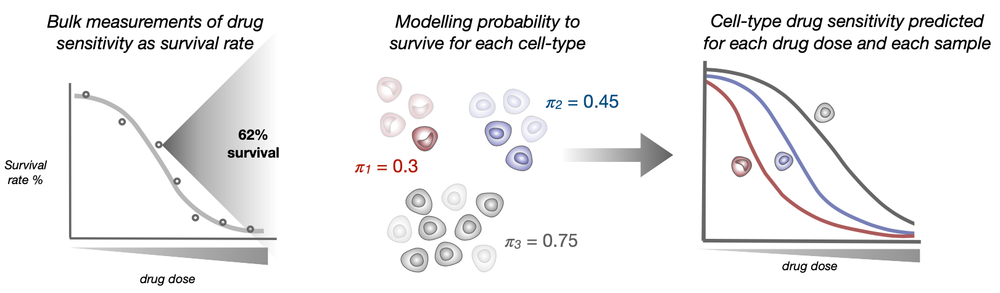

.. pyTEnrich documentation master file, created by
   sphinx-quickstart on Wed Dec 30 11:29:02 2020.
   You can adapt this file completely to your liking, but it should at least
   contain the root `toctree` directive.

.. image:: images/CLIFF_logo_design.png

.. toctree::
   :maxdepth: 1
   :caption: Contents: 
   
   usage/installation.rst
   usage/execution.rst
   usage/detailmethods.rst
   usage/results.rst
   source/CLIFF.rst
   
Overview of the methods
=======================

**CLIFF** uncovers the impact of specific cell subtypes on drug response by integrating single-cell RNA-seq and ex-vivo drug sensitivity assays. In particular, **CLIFF** relies on integrating cell subtype abundance and cell-type expression with bulk drug sensitivity to infer the cell subtypes’ drug susceptibility. Cell subtype abundance / expression can be measured with scRNA-seq or inferred with `CLIMB <https://github.com/alexdray86/CLIMB>`_ or any other bulk deconvolution technique. 

**CLIFF** relies on a new mathematical model using cell-subtype- associated latent variables, which we resolve with an Expectation-Maximization algorithm. 

:ref:`detailmethods`
