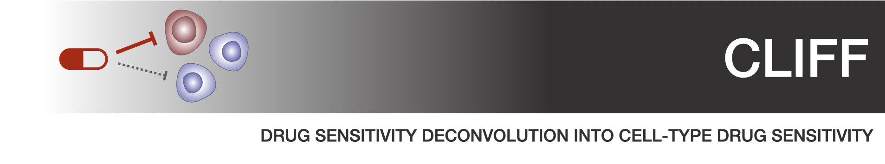

.. pyTEnrich documentation master file, created by
   sphinx-quickstart on Wed Dec 30 11:29:02 2020.
   You can adapt this file completely to your liking, but it should at least
   contain the root `toctree` directive.

.. toctree::
   :maxdepth: 1
   :caption: Contents: 
   
   usage/installation.rst
   usage/execution.rst
   usage/detailmethods.rst
   usage/results.rst
   source/CLIFF.rst
   
Overview of CLIFF method
=======================

The **CLIFF** method deconvolute cell subtypes drug sensitivity by integrating single-cell RNA sequencing data and ex-vivo drug sensitivity assays. For that matter, **CLIFF** leverages cell-subtype abundance and cell-type expression with bulk drug sensitivity to infer the drug susceptibility of individual cell subtypes. The measurement of cell-subtype abundance and expression can be accomplished through single-cell RNA sequencing or inferred through the use of techniques such as `CLIMB <https://alexdray86.github.io/CLIMB/build/index.html>`_ or other bulk deconvolution methods.

.. image:: images/cliff_schemes3.png

**CLIFF** relies on a new mathematical model using cell-subtype- associated latent variables, which we resolve with an Expectation-Maximization algorithm. More details in :ref:`detailmethods`.
