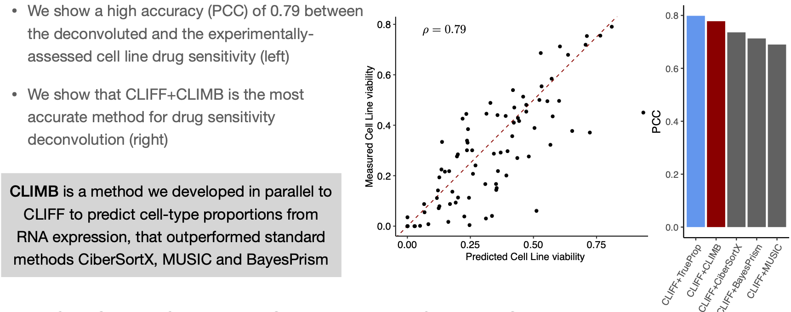
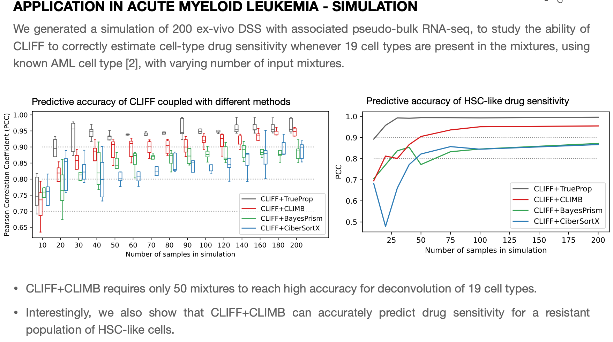

.. _results:

Examples of CLIFF results
________________

**DISCUSSION AND CONCLUSION**

By integrating multiple data types, we proposed through this work to improve predictions of cellular composition
and cellular drug sensitivity in the context of AML disease. This could potentially enable the early detection of
resistant populations of cancer stem cells to venetoclax therapy, one of the most used targeted therapy in Acute
Myeloid Leukemia.

